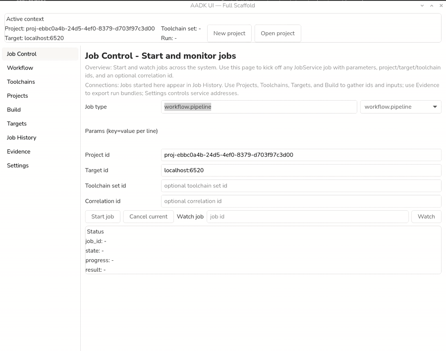

[](docs/ARM64.mp4)

# APK Workbench

GUI-first, multi-service gRPC platform for Android development workflows. The GTK UI and CLI
are thin clients; all real work lives in the service crates. JobService is the event bus that
streams job state/progress/logs to clients.

- Source repository: `https://github.com/Denuo-Web/APK-Workbench`
- Releases: `https://github.com/Denuo-Web/APK-Workbench/releases`

## Supported host
- Linux ARM64 (aarch64) is the only supported host for running the full stack (services/UI/Cuttlefish).
- Debian 13 on Linux ARM64 is the primary validated distro for full-stack support, release smoke tests,
  and Cuttlefish host-tool automation. Raspberry Pi OS 64-bit is included in that path.
- Non-Debian Linux ARM64 hosts are experimental for the full stack and generally require explicit
  overrides such as `APKW_CUTTLEFISH_INSTALL_CMD`.
- x86_64 is intentionally out of scope because Android Studio already covers it.
- Toolchain catalog includes Linux ARM64 SDK/NDK artifacts plus Windows ARM64 NDK artifacts (r29/r28c/r27d);
  no darwin SDK/NDK artifacts are published in the custom catalogs.

## Architecture at a glance
- GTK4 UI and CLI call gRPC services; they do not implement business logic.
- JobService stores job records, replays history, and streams live events (including run-level aggregation).
- Toolchain/Build/Targets/Observe services create jobs and publish events to JobService.
- ObserveService stores run history plus run output inventory (bundles/artifacts) with a summary pointer for dashboards.
- ProjectService is the source of truth for project metadata and template setup.
- WorkflowService orchestrates multi-step pipelines and upserts run records for observability.

## Source map (main entry points)
- JobService: `crates/apkw-core/src/main.rs`
- WorkflowService: `crates/apkw-workflow/src/main.rs`
- ToolchainService: `crates/apkw-toolchain/src/main.rs`
- ProjectService: `crates/apkw-project/src/main.rs`
- BuildService: `crates/apkw-build/src/main.rs`
- TargetService: `crates/apkw-targets/src/main.rs`
- ObserveService: `crates/apkw-observe/src/main.rs`
- GTK UI: `crates/apkw-ui/src/main.rs`
- CLI: `crates/apkw-cli/src/main.rs`
- Proto contracts: `proto/apkw/v1`
- Rust gRPC types: `crates/apkw-proto`
- Dev runner: `scripts/dev/run-all.sh`
- External Gradle wrapper: `scripts/dev/apkw-gradle.sh`
- Agent notes: `AGENTS.md` and `crates/*/AGENTS.md`

## Runtime topology
Default addresses (override via env):
- Job/Core:     127.0.0.1:50051 (APKW_JOB_ADDR)
- Toolchain:    127.0.0.1:50052 (APKW_TOOLCHAIN_ADDR)
- Project:      127.0.0.1:50053 (APKW_PROJECT_ADDR)
- Build:        127.0.0.1:50054 (APKW_BUILD_ADDR)
- Targets:      127.0.0.1:50055 (APKW_TARGETS_ADDR)
- Observe:      127.0.0.1:50056 (APKW_OBSERVE_ADDR)
- Workflow:     127.0.0.1:50057 (APKW_WORKFLOW_ADDR)

## Data and state locations
- Jobs: `~/.local/share/apkw/state/jobs.json`
- UI config: `~/.local/share/apkw/state/ui-config.json`
- CLI config: `~/.local/share/apkw/state/cli-config.json`
- Toolchains: `~/.local/share/apkw/state/toolchains.json`
- Toolchain downloads: `~/.local/share/apkw/downloads`
- Toolchain installs: `~/.local/share/apkw/toolchains`
- Projects: `~/.local/share/apkw/state/projects.json`
- Project metadata: `<project>/.apkw/project.json`
- Builds: `~/.local/share/apkw/state/builds.json`
- Observe runs: `~/.local/share/apkw/state/observe.json`
- Observe bundles: `~/.local/share/apkw/bundles`
- UI/CLI log exports: `~/.local/share/apkw/state/*-job-export-*.json`

## Third-party inventory (downloaded on demand)
This repo does not bundle third-party toolchains; services download or invoke them when requested.
- Android SDK/NDK custom archives (ToolchainService catalog in `crates/apkw-toolchain/catalog.json`,
  override with `APKW_TOOLCHAIN_CATALOG`):
  - SDK (aarch64-linux-musl):
    - 36.0.0 (2025-11-19): `https://github.com/HomuHomu833/android-sdk-custom/releases/download/36.0.0/android-sdk-aarch64-linux-musl.tar.xz`
    - 35.0.2 (2025-10-11): `https://github.com/HomuHomu833/android-sdk-custom/releases/download/35.0.2/android-sdk-aarch64-linux-musl.tar.xz`
  - SDK (aarch64_be-linux-musl):
    - 36.0.0 (2025-11-19): `https://github.com/HomuHomu833/android-sdk-custom/releases/download/36.0.0/android-sdk-aarch64_be-linux-musl.tar.xz`
    - 35.0.2 (2025-10-11): `https://github.com/HomuHomu833/android-sdk-custom/releases/download/35.0.2/android-sdk-aarch64_be-linux-musl.tar.xz`
  - NDK (aarch64-linux-musl):
    - r29 (2025-09-08): `https://github.com/HomuHomu833/android-ndk-custom/releases/download/r29/android-ndk-r29-aarch64-linux-musl.tar.xz`
    - r28c (2025-07-19): `https://github.com/HomuHomu833/android-ndk-custom/releases/download/r28/android-ndk-r28c-aarch64-linux-musl.tar.xz`
    - r27d (2025-07-19): `https://github.com/HomuHomu833/android-ndk-custom/releases/download/r27/android-ndk-r27d-aarch64-linux-musl.tar.xz`
    - r26d (2025-07-19): `https://github.com/HomuHomu833/android-ndk-custom/releases/download/r26/android-ndk-r26d-aarch64-linux-musl.tar.xz`
  - NDK (aarch64-linux-android):
    - r29 (2025-09-08): `https://github.com/HomuHomu833/android-ndk-custom/releases/download/r29/android-ndk-r29-aarch64-linux-android.tar.xz`
    - r28c (2025-07-19): `https://github.com/HomuHomu833/android-ndk-custom/releases/download/r28/android-ndk-r28c-aarch64-linux-android.tar.xz`
    - r27d (2025-07-19): `https://github.com/HomuHomu833/android-ndk-custom/releases/download/r27/android-ndk-r27d-aarch64-linux-android.tar.xz`
    - r26d (2025-07-19): `https://github.com/HomuHomu833/android-ndk-custom/releases/download/r26/android-ndk-r26d-aarch64-linux-android.tar.xz`
  - NDK (aarch64_be-linux-musl):
    - r29 (2025-09-08): `https://github.com/HomuHomu833/android-ndk-custom/releases/download/r29/android-ndk-r29-aarch64_be-linux-musl.tar.xz`
    - r28c (2025-07-19): `https://github.com/HomuHomu833/android-ndk-custom/releases/download/r28/android-ndk-r28c-aarch64_be-linux-musl.tar.xz`
    - r27d (2025-07-19): `https://github.com/HomuHomu833/android-ndk-custom/releases/download/r27/android-ndk-r27d-aarch64_be-linux-musl.tar.xz`
    - r26d (2025-07-19): `https://github.com/HomuHomu833/android-ndk-custom/releases/download/r26/android-ndk-r26d-aarch64_be-linux-musl.tar.xz`
  - NDK (windows-aarch64, .7z):
    - r29 (2025-09-08): `https://github.com/HomuHomu833/android-ndk-custom/releases/download/r29/android-ndk-r29-aarch64-w64-mingw32.7z`
    - r28c (2025-07-19): `https://github.com/HomuHomu833/android-ndk-custom/releases/download/r28/android-ndk-r28c-aarch64-w64-mingw32.7z`
    - r27d (2025-07-19): `https://github.com/HomuHomu833/android-ndk-custom/releases/download/r27/android-ndk-r27d-aarch64-w64-mingw32.7z`
  - Windows ARM64 NDK archives require `7z` for extraction; no darwin SDK/NDK artifacts are
    currently published in the custom catalogs.
  - These repos are MIT licensed; review upstream Android SDK/NDK terms if you plan to redistribute.
- Cuttlefish host tools install uses the android-cuttlefish apt repo on Debian/Ubuntu by default
  (`https://us-apt.pkg.dev/projects/android-cuttlefish-artifacts`); Debian 13 is the validated
  path, and other distros require `APKW_CUTTLEFISH_INSTALL_CMD`.
- Cuttlefish images from `ci.android.com` / `android-ci.googleusercontent.com`.
- Gradle via `gradlew` or system `gradle`.
- adb/platform-tools from the Android SDK or Cuttlefish host tools.

## Quick start (Debian 13 aarch64)
This is the primary validated host path for the full stack. Other Linux ARM64 distros may work,
but they are not currently treated as a first-class support target.

### 1) System dependencies
```bash
sudo apt update
sudo apt install -y \
  build-essential pkg-config \
  libgtk-4-dev \
  libwebkitgtk-6.0-dev \
  protobuf-compiler \
  git curl \
  xz-utils zstd
```

`libwebkitgtk-6.0-dev` is required to build `apkw-ui` now that the Targets page
embeds the Cuttlefish WebRTC view inside the GTK app.

### 2) Rust toolchain (if needed)
```bash
curl https://sh.rustup.rs -sSf | sh
source "$HOME/.cargo/env"
rustup default stable
```

### 3) Build everything
```bash
cargo build
```

### 4) Run all services
Terminal A:
```bash
./scripts/dev/run-all.sh
```

Override any address with env vars:
```bash
APKW_JOB_ADDR=127.0.0.1:60051 ./scripts/dev/run-all.sh
```

### 5) Run the GUI
Terminal B:
```bash
cargo run -p apkw-ui
```

If you see a GTK warning about the accessibility bus on minimal installs, either install
`at-spi2-core` or suppress it for local dev:
```bash
GTK_A11Y=none cargo run -p apkw-ui
```

### 6) Optional: CLI sanity checks
```bash
cargo run -p apkw-cli -- toolchain list-providers
cargo run -p apkw-cli -- toolchain list-sets
cargo run -p apkw-cli -- targets list
cargo run -p apkw-cli -- observe list-runs
cargo run -p apkw-cli -- observe export-support
cargo run -p apkw-cli -- project use-active-defaults <project_id>
```

## Building another Android project with APK Workbench toolchains
When you are working in a separate Android app repo on this ARM64 host, use the APK Workbench
wrapper instead of calling `./gradlew` directly. It auto-detects the local ARM64 SDK/NDK, chooses
the installed `aapt2`, and fills in the Gradle property override that otherwise tends to fall back
to incompatible x86 tooling. By default it prefers APK Workbench-managed toolchains even if your
shell already exports `ANDROID_SDK_ROOT`; set
`APKW_GRADLE_RESPECT_EXISTING_ENV=1` if you explicitly want to keep the current shell SDK/NDK env.
The wrapper also passes `apkw.hostPageSize`, `apkw.hostPageProfile`, `apkw.hostOsId`, and
`apkw.hostOsVersionId` into Gradle so external projects can adapt their own build logic.

```bash
/home/den/Documents/APK_Workbench/scripts/dev/apkw-gradle.sh \
  --project-dir /path/to/android-project \
  assembleDebug
```

To inspect what environment it would use without running Gradle:

```bash
/home/den/Documents/APK_Workbench/scripts/dev/apkw-gradle.sh --print-env
```

## Release builds (Linux aarch64)
Build all workspace binaries:
```bash
cargo build --release --workspace
ls -1 target/release/apkw-*
```

Primary GitHub Releases artifact:
```bash
VERSION=0.1.0
OUT=dist/apkw-${VERSION}-linux-aarch64
mkdir -p "${OUT}"
cp target/release/apkw-{core,workflow,toolchain,project,build,targets,observe,ui,cli} "${OUT}/"
cp scripts/release/apkw-start.sh "${OUT}/apkw-start.sh"
cp scripts/release/apkw-env.sh "${OUT}/apkw-env.sh"
cp README.md LICENSE "${OUT}/"
tar -C dist -czf "apkw-${VERSION}-linux-aarch64.tar.gz" "apkw-${VERSION}-linux-aarch64"
sha256sum "apkw-${VERSION}-linux-aarch64.tar.gz" > "apkw-${VERSION}-linux-aarch64.tar.gz.sha256"
```

Upload `apkw-${VERSION}-linux-aarch64.tar.gz` and its `.sha256` file to a GitHub Release in
`Denuo-Web/APK-Workbench`.
GitHub Packages is not used for native APKW desktop binaries.

Optional Debian convenience package:
```bash
VERSION=0.1.0 scripts/release/build-deb.sh
```

See `docs/release.md`, `scripts/release/build.sh`, and `scripts/release/build-deb.sh` for the
scripted flows.

## What is implemented today

### JobService (apkw-core)
- Persisted job registry with bounded history, retention cleanup, and broadcast streaming.
- `include_history` replay followed by live event streaming.
- StreamRunEvents aggregates run events across jobs with bounded buffering and best-effort timestamp ordering.
- ListJobs/ListJobHistory APIs with pagination and filters (type/state/time/run_id, event kinds).
- Validates job types and reserves workflow.pipeline for multi-step orchestration.
- Supports run_id + correlation_id grouping (StartJob + ListJobs filter).

### ToolchainService (apkw-toolchain)
- Provider catalog with host-aware artifacts (override via `APKW_TOOLCHAIN_CATALOG`).
- Installs, updates, uninstalls, and verifies SDK/NDK toolchains with JobService events; supports cache cleanup.
- Verification validates provenance, catalog entries, artifact size, signatures and transparency log entries (when configured), and layout; supports fixture archives via `APKW_TOOLCHAIN_FIXTURES_DIR`.

### ProjectService (apkw-project)
- Template registry backed by JSON (`APKW_PROJECT_TEMPLATES` or default registry).
- Template defaults (minSdk/compileSdk) resolved from registry/Gradle files with schema validation.
- Create/open project, create files on disk, store metadata and recents.
- Exposes GetProject for authoritative project resolution.

### BuildService (apkw-build)
- Resolves project paths via ProjectService IDs (or accepts direct paths) and persists build/artifact records with module/variant/task selections.
- Runs Gradle with wrapper checks and GRADLE_USER_HOME defaults; validates module/variant via Gradle model introspection and streams logs.
- Scans build outputs for APK/AAB/AAR/mapping/test results, parses output metadata, tags metadata (module/variant/build_type/flavors/abi/density/task/artifact_type), and supports artifact filters with sha256.
- When run_id is provided, build artifacts are recorded as ObserveService run outputs for dashboards.

### TargetService (apkw-targets)
- Enumerates targets via provider pipeline (ADB + Cuttlefish), normalizes IDs, enriches health metadata, and persists inventory + default target.
- Install APK, launch/stop app, stream logcat, and manage Cuttlefish; publishes job events.

### ObserveService (apkw-observe)
- Persists run history and output inventory (bundles/artifacts) with run_id/correlation_id and project/target/toolchain ids.
- Exports support/evidence bundles as JobService jobs with progress/log streaming and retention.
- Support bundles include job log history plus config/state snapshots.
- Bundle exports are recorded as run outputs for dashboards and output listings.
- UpsertRun supports best-effort run tracking from multi-service pipelines.
- ListRunOutputs exposes bundle/artifact inventory with run output summary pointers (counts, last updated, last bundle id).

### WorkflowService (apkw-workflow)
- Runs workflow.pipeline to orchestrate project creation/opening, toolchain verify, build, install, launch, and bundle export steps.
- Emits job progress/logs for each step and waits for step jobs to complete before proceeding.
- Uses run_id to correlate jobs and upserts run records to ObserveService.
- Build steps upsert artifact outputs to ObserveService so run dashboards list outputs.

### GTK UI (apkw-ui)
- Home: run jobs with type/params/ids, watch streams, live status panel.
- Workflow: run workflow.pipeline with step inputs and stream run-level events.
- Job History: list jobs and event history with filters; export logs.
- Toolchains: list/install/verify/update/uninstall, cache cleanup, list toolchain sets.
- Projects: list templates, create/open, list recents, set config, use active defaults.
- Targets: list targets, install APK, launch, logcat, Cuttlefish controls.
- Console: run Gradle builds with module/variant/task selection, list artifacts with filters grouped by module, stream logs.
- Evidence: list runs, list outputs with filters, group jobs by run, stream run events, export support/evidence bundles, and export job logs.
- Workflow/Toolchains/Projects/Targets/Console/Evidence pages include job_id reuse and correlation_id inputs for multi-job workflows.

### CLI (apkw-cli)
- Job run/list/watch/history/export/cancel + watch-run (aggregated run stream).
- Toolchain list-providers/list-sets/update/uninstall/cleanup-cache.
- Targets list/start/stop/status/install Cuttlefish.
- Projects list-templates/list-recent/create/open/use-active-defaults.
- Observe list-runs/list-outputs/export-support/export-evidence.
- Build run/list-artifacts with module/variant/tasks + artifact filters.
- Workflow run-pipeline to orchestrate multi-step flows.
- Long-running commands accept --job-id/--correlation-id/--run-id for workflow grouping.

## Extending from here (recommended order)
1. Add pickers for workflow inputs (templates/toolchain sets/targets) and persist last workflow fields in UI config.
2. Expand the Evidence dashboard with run filters and output shortcuts (open/export).
3. Add a CLI helper to tail StreamRunEvents after workflow runs.


## Development notes
- gRPC uses TCP loopback for simplicity; Unix domain sockets are a straightforward follow-on.
- UI uses a background tokio runtime to keep the GTK main thread responsive.
- Job workflows publish progress metrics via JobService; run `apkw-core` to see UI streams.

## Why APK Workbench (ARM64 gap)
APK Workbench targets efficient, ARM64-first Android development tooling (not an IDE clone), because the
official Android Studio stack does not cover ARM64 hosts today.

Primary sources behind this gap:
- Android Studio Linux docs: "Linux machines with ARM-based CPUs aren't supported," and the CPU
  requirement lists "x86_64 CPU architecture." https://developer.android.com/studio/platform/install
- Google issue tracker: "Android Studio is not available on Windows Arm." https://issuetracker.google.com/issues/351408627
- Google issue tracker: "Emulator is not available on Windows/Linux arm64." https://issuetracker.google.com/issues/386749845
- .NET Android workload supports Windows ARM64, but it is a .NET stack and not a full Android Studio
  replacement. https://github.com/dotnet/android/blob/main/Documentation/guides/WindowsOnArm64.md

Community ARM64 tooling references:
- android-tools (platform tools like adb/fastboot) for aarch64 in Arch Linux ARM. https://archlinuxarm.org/packages/aarch64/android-tools
- android-sdk-tools community repo building platform-tools/build-tools with aarch64 testing. https://github.com/Lzhiyong/android-sdk-tools
- AndroidIDE tools repo (JDK + Android SDK tooling for AndroidIDE). https://github.com/AndroidIDEOfficial/androidide-tools

## Cuttlefish target provider
TargetService can surface a local Cuttlefish instance as a `provider=cuttlefish` target. It:
- uses `cvd status` when available to detect running state and adb serial
- optionally issues `adb connect` to the configured serial
- reports state from adb (`device`, `offline`) or Cuttlefish (`running`, `stopped`, `error`)
- annotates details with adb state, API level, build/branch/paths, and raw status output

Prerequisites (per Android Cuttlefish docs):
- KVM virtualization is required. Check `/dev/kvm` (or `find /dev -name kvm` on ARM64); enable nested virtualization on cloud hosts.
- Ensure the user is in `kvm`, `cvdnetwork`, and `render` groups; re-login or reboot after group changes.
- Host tools and images should come from the same build id (Install Cuttlefish enforces this).
- Debian 13 ARM64, including Raspberry Pi OS 64-bit, is the validated host path for the
  default android-cuttlefish apt install; other distros require `APKW_CUTTLEFISH_INSTALL_CMD`
  and are currently experimental.

Defaults (when not overridden):
- Branch: `aosp-android-latest-release` for 4K hosts; `main-16k-with-phones` for 16K.
- Targets: `aosp_cf_arm64_only_phone-userdebug` (ARM64), `aosp_cf_x86_64_only_phone-userdebug` (x86_64), or `aosp_cf_riscv64_phone-userdebug` (riscv64). 16K defaults to `aosp_cf_arm64` / `aosp_cf_x86_64`.

Host page-size adaptation:
- APK Workbench auto-detects the running host page size and switches between 4K and 16K defaults automatically.
- Set `APKW_HOST_PAGE_SIZE=4096` or `APKW_HOST_PAGE_SIZE=16384` to override detection explicitly when you need to force one profile.

GPU acceleration:
- Android 11+ guests use accelerated graphics when the host supports it; otherwise SwiftShader is used.
- Host requirements: EGL driver with `GL_KHR_surfaceless_context`, OpenGL ES, and Vulkan support.
- Use `APKW_CUTTLEFISH_GPU_MODE=gfxstream` (OpenGL+Vulkan passthrough) or `APKW_CUTTLEFISH_GPU_MODE=drm_virgl` (OpenGL only) to set `--gpu_mode=...` when starting.

WebRTC streaming:
- Launch with `--start_webrtc=true` (TargetService sets this automatically when "show full UI" is selected; override via `APKW_CUTTLEFISH_START_ARGS`).
- Web UI is available at `https://localhost:8443` by default (`APKW_CUTTLEFISH_WEBRTC_URL` overrides).
- Remote access requires firewall access for TCP 8443 and TCP/UDP 15550-15599.
- Standalone smoke test (outside APKW):
  - `HOME="$HOME/.local/share/apkw/cuttlefish/16k" cvd reset -y`
  - `HOME="$HOME/.local/share/apkw/cuttlefish/16k" "$HOME/.local/share/apkw/cuttlefish/16k/bin/launch_cvd" --daemon --system_image_dir="$HOME/.local/share/apkw/cuttlefish/16k" --report_anonymous_usage_stats=n --start_webrtc=true --enable_tap_devices=false`
  - `"$HOME/.local/share/apkw/cuttlefish/16k/bin/adb" connect 0.0.0.0:6520 && "$HOME/.local/share/apkw/cuttlefish/16k/bin/adb" -s 0.0.0.0:6520 get-state` should print `device`.
  - `curl -k https://localhost:8443/devices` should list `cvd-1`.
  - Stop with `HOME="$HOME/.local/share/apkw/cuttlefish/16k" "$HOME/.local/share/apkw/cuttlefish/16k/bin/stop_cvd"`.

Environment control (REST/CLI):
- REST endpoint: `https://localhost:1443` (`APKW_CUTTLEFISH_ENV_URL` overrides).
- Example REST paths:
  - `GET /devices/DEVICE_ID/services`
  - `GET /devices/DEVICE_ID/services/SERVICE_NAME`
  - `POST /devices/DEVICE_ID/services/SERVICE_NAME/METHOD_NAME` with JSON-formatted proto payload.
- CLI equivalents: `cvd env ls`, `cvd env type SERVICE_NAME REQUEST_TYPE`, `cvd env call SERVICE_NAME METHOD_NAME '{...}'`.
- Services: `GnssGrpcProxy`, `OpenwrtControlService`, `WmediumdService`, `CasimirControlService`.

Wi-Fi:
- Cuttlefish uses Wmediumd to simulate wireless medium.
- Android 14+ uses `WmediumdService` (via env control REST/CLI); Android 13 or lower uses `wmediumd_control`.
- OpenWRT AP: default device id is `cvd-1`; default WAN IP is `192.168.94.2` or `192.168.96.2` when no launch options are provided.
- OpenWRT access: `ssh root@OPENWRT_WAN_IP_ADDRESS` or `https://localhost:1443/devices/DEVICE_ID/openwrt`.
- If launcher logs show `failed to open tap device ... Operation not permitted`, host TAP setup is blocked.
  Use `--enable_tap_devices=false` (or `APKW_CUTTLEFISH_START_ARGS=--enable_tap_devices=false`) to boot without TAP-backed networking.
  This keeps WebRTC + adb working but disables bridged Wi-Fi/OpenWRT networking features.
  APKW auto-detects this condition and applies `--enable_tap_devices=false` unless an explicit
  `--enable_tap_devices=...` flag is already present in `APKW_CUTTLEFISH_START_ARGS`.

Bluetooth:
- Rootcanal is controlled from the Web UI command console.
- Commands: `list`, `add DEVICE_TYPE [ARGS]`, `del DEVICE_INDEX`, `add_phy PHY_TYPE`, `del_phy PHY_INDEX`,
  `add_device_to_phy DEVICE_INDEX PHY_INDEX`, `del_device_from_phy DEVICE_INDEX PHY_INDEX`,
  `add_remote HOSTNAME PORT PHY_TYPE`.
- Device types: `beacon`, `scripted_beacon`, `keyboard`, `loopback`, `sniffer`.

Configuration (env vars):
- `APKW_CUTTLEFISH_ENABLE=0` to disable detection
- `APKW_CVD_BIN=/path/to/cvd` to override the `cvd` command
- `APKW_LAUNCH_CVD_BIN=/path/to/launch_cvd` to override the launch command
- `APKW_STOP_CVD_BIN=/path/to/stop_cvd` to override the stop command
- `APKW_CUTTLEFISH_ADB_SERIAL=127.0.0.1:6520` to override the adb serial
- `APKW_CUTTLEFISH_CONNECT=0` to skip `adb connect`
- `APKW_CUTTLEFISH_WEBRTC_URL=https://localhost:8443` to override the WebRTC viewer URL
- `APKW_CUTTLEFISH_ENV_URL=https://localhost:1443` to override the environment control endpoint
- `APKW_CUTTLEFISH_PAGE_SIZE_CHECK=0` to skip the kernel page-size preflight check
- `APKW_HOST_PAGE_SIZE=4096|16384` to override the detected host page-size profile
- `APKW_CUTTLEFISH_KVM_CHECK=0` to skip the KVM availability/access check
- `APKW_CUTTLEFISH_GPU_MODE=gfxstream|drm_virgl` to set the GPU acceleration mode
- `APKW_CUTTLEFISH_HOME=/path` (or `_16K`/`_4K`) to set the base Cuttlefish home directory
- `APKW_CUTTLEFISH_IMAGES_DIR=/path` (or `_16K`/`_4K`) to override the images directory
- `APKW_CUTTLEFISH_HOST_DIR=/path` (or `_16K`/`_4K`) to override the host tools directory
- `APKW_CUTTLEFISH_START_CMD="..."` to override the start command
- `APKW_CUTTLEFISH_START_ARGS="..."` to append args to `cvd start`/`launch_cvd`
- `APKW_CUTTLEFISH_AUTO_RESOURCES=1|0` to enable/disable host-based auto CPU/RAM limits (default `1`)
- `APKW_CUTTLEFISH_CPUS=<n>` to force `--cpus=<n>` when start args do not already define CPU count
- `APKW_CUTTLEFISH_MEMORY_MB=<mb>` to force `--memory_mb=<mb>` when start args do not already define memory
- `APKW_CUTTLEFISH_AUTO_DISPLAY=1|0` to enable/disable host-based display sizing (default `1`)
- `APKW_CUTTLEFISH_X_RES=<px>` to force `--x_res=<px>` when start args do not already define display width
- `APKW_CUTTLEFISH_Y_RES=<px>` to force `--y_res=<px>` when start args do not already define display height
- `APKW_CUTTLEFISH_DPI=<n>` to force `--dpi=<n>` when start args do not already define display density
- `APKW_CUTTLEFISH_TAP_MODE=auto|enabled|disabled` to control TAP probing behavior (`auto` default)
- `APKW_CUTTLEFISH_ENABLE_TAP=1|0` legacy alias for enabling/disabling TAP mode
- `APKW_CUTTLEFISH_STOP_CMD="..."` to override the stop command
- `APKW_CUTTLEFISH_INSTALL_CMD="..."` to override the host install command (required on non-Debian hosts; non-Debian full-stack support is experimental)
- `APKW_CUTTLEFISH_INSTALL_HOST=0` to skip host package installation
- `APKW_CUTTLEFISH_INSTALL_IMAGES=0` to skip image downloads
- `APKW_CUTTLEFISH_ADD_GROUPS=0` to skip adding the user to kvm/cvdnetwork/render
- `APKW_CUTTLEFISH_BRANCH=<branch>` (or `_16K`/`_4K`) to override the AOSP branch used for image fetch
- `APKW_CUTTLEFISH_TARGET=<target>` (or `_16K`/`_4K`) to override the AOSP target used for image fetch
- `APKW_CUTTLEFISH_BUILD_ID=<id>` to pin a specific AOSP build id
- `APKW_ADB_PATH` or `ANDROID_SDK_ROOT` to locate `adb`

### Pinning Cuttlefish builds
To pin images to a known build, set `APKW_CUTTLEFISH_BUILD_ID` (optionally with branch/target):
```bash
APKW_CUTTLEFISH_BRANCH=aosp-android-latest-release \
APKW_CUTTLEFISH_TARGET=aosp_cf_arm64_only_phone-userdebug \
APKW_CUTTLEFISH_BUILD_ID=12345678 \
./scripts/dev/run-all.sh
```
The GTK UI also exposes branch/target/build id fields plus a "Resolve Build ID" button so you can
confirm the resolved build before running Install Cuttlefish.

Notes:
- The UI and CLI pass `include_offline=true`, so a stopped Cuttlefish instance still appears.
- Start/stop/status actions are exposed in the UI and CLI (Targets -> Start/Stop/Status Cuttlefish).
- Install Cuttlefish uses public artifacts from `ci.android.com`.
- On smaller hosts, TargetService now auto-applies conservative launch limits and display sizing
  (for 4-core / ~8GB hosts: `--cpus=2 --memory_mb=3072 --x_res=720 --y_res=1280 --dpi=280`)
  unless you already set those args in `APKW_CUTTLEFISH_START_ARGS`.
- TargetService also patches empty `usr/share/webrtc/assets/custom.css` files in local Cuttlefish
  installs to avoid intermittent Web UI stylesheet dropouts on refresh.

## Portfolio Case Study

This repository is part of Jaron Rosenau's implementation, developer-support, and integration engineering portfolio. The public case study summarizes the problem, delivery scope, architecture, and operational result.

- Case study: [APK Workbench implementation case study](https://rosenau.info/projects/5phdbvm9zjsJugRVH62R)
- Full portfolio: [Jaron Rosenau](https://rosenau.info)
- Summary: Linux ARM64 Android tooling with Rust services, GTK UI, gRPC orchestration, packaged releases, and support-oriented docs.
